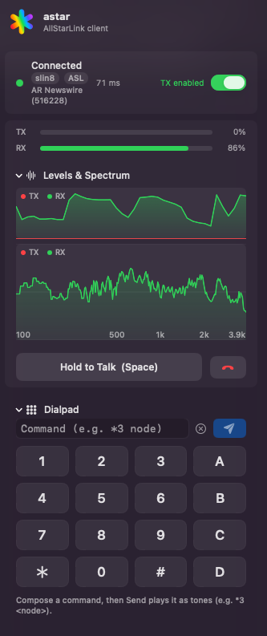

# The macOS app

astar on macOS is a **menu-bar app** that also, by default, shows up in the Dock
and in Cmd-Tab. After launch, look for the **rainbow asterisk** in the menu bar —
the product mark, a six-spoke asterisk, not a five-pointed star. Left-click opens
the dial popover; everything the client does happens there or in Settings.

To run it without a Dock icon, right-click the asterisk and turn off **Show in
Dock**. It takes effect immediately and persists across launches.

<figure markdown="span">
  { width="333" }
  <figcaption>Connected, receiving, with the spectrum and dialpad open.</figcaption>
</figure>

[Download astar.dmg](https://github.com/rcludwick/astar/releases/latest){ .md-button .md-button--primary }
[First run walkthrough](first-run.md){ .md-button }

!!! info "Requirements"

    macOS **13 (Ventura) or later**. The deployment target is set in
    `apps/macos/project.yml` and in AstarCore's `Package.swift`; the SwiftUI
    APIs the app uses that need it include `ViewThatFits`, in the status row.
    Building it also needs a full Xcode; see
    [Build it from source](../build/macos-app.md).

## What is in the popover

The popover is the whole client. In broad strokes:

* **Network picker** — AllStarLink or M17.
* **Dial field** — a node number or an address, plus favorites and recents.
* **Connect / Disconnect**, with call state and round-trip time.
* **Push to talk** — press-and-hold in the UI, a hardware operator key on a USB
  radio interface, or VOX. Also a *TX disabled — listening only* mode when you
  want to monitor without any chance of keying.
* **Dialpad** for DTMF commands to the far end.
* **Quick settings** — input and output device, gains, VOX threshold and hang
  time, codec, talk timer.
* **Level meters and spectrum** for what you are sending and receiving.

Settings adds the rest: your AllStarLink account, saved configs ("setups"),
microphone profiles and characterization, serial PTT wiring, and device
selection.

The running version is shown in the popover footer, so you can always tell what
you are looking at.

## Networks

| Network | Notes |
|---|---|
| **AllStarLink (IAX2)** | The primary target. Dials nodes; speaks the `app_rpt` link-layer dialect on top of IAX2. |
| **M17** | Native support, including reflectors. Transmits your callsign, so set it before you key. The app links Codec 2 in, so there is nothing to install; a system `libcodec2` is used in preference when one is present — see [Codec 2](../build/prerequisites.md#codec-2-only-for-m17). |
| **D-Star** *(engine only)* | Implemented in the Rust engine — XLX/XRF reflectors over DExtra, AMBE+2 on a ThumbDV or DV3000 dongle — but **not exposed in this client yet**. See [Vocoder dongles](hardware.md#vocoder-dongles). |

## Audio and PTT hardware

astar targets the generic class of USB radio interfaces — serial PTT plus USB
audio. The AllScan UCI150 is the reference device, not a special case. The
[Hardware](hardware.md) page covers the macOS driver situation and how the PTT
lines are wired.

## What these docs cover

Install and hardware setup, and a stub for day-to-day operating — see
[Using astar](usage.md). Detailed usage documentation has not been written yet.
