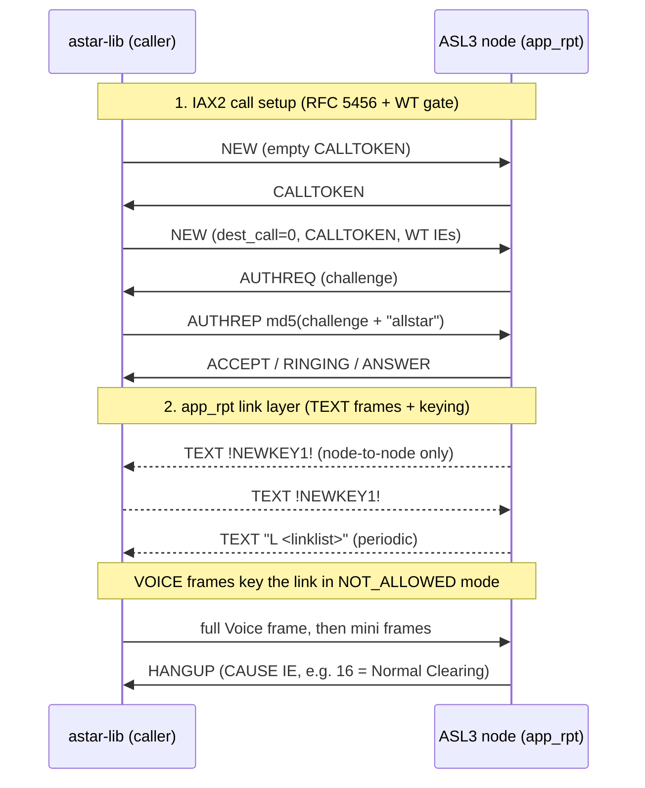

# ASL3 / IAX2 protocol notes

These pages document the **AllStarLink (ASL3) IAX2 protocol** as
reverse-engineered while building **astar-lib** — the greenfield Rust IAX2
client and protocol core that drives astar. They are written for anyone
implementing an interoperable IAX2 endpoint that talks to AllStarLink's
[`app_rpt`][allstar], and as a permanent record of what was learned testing
against the public infrastructure.

[allstar]: https://github.com/AllStarLink

There are two layers, documented on two pages:

-   __[app_rpt IAX2 TEXT commands](app-rpt-text-commands.md)__

    The **link layer** `app_rpt` speaks *inside* an established IAX2 call:
    the `AST_FRAME_TEXT` control vocabulary — `!NEWKEY1!`, `!NEWKEY!`,
    `!!DISCONNECT!!`, the periodic `L <linklist>` frames — and the three
    radio-keying modes (`RADIO_KEY_ALLOWED` / `_REDUNDANT` / `_NOT_ALLOWED`).
    Every claim cited to the `app_rpt` C source.

-   __[Web Transceiver call flow](web-transceiver-call-flow.md)__

    The **end-to-end call**: how a Web Transceiver guest authenticates
    against the AllStarLink portal, the exact IAX2 `NEW` call shape ASL3
    expects (CALLTOKEN, `dest_call=0`, the WT IEs), the media rules
    (first-frame-must-be-full Voice), keepalives, and hangup-cause handling.

## How the two layers fit together

The first phase is *mostly* plain IAX2 ([RFC 5456][rfc]); ASL3 layers a
**Web Transceiver token gate** on top of it. The second phase — the TEXT
handshake and voice-keying — is entirely an `app_rpt` invention with no RFC
basis. Both pages call out precisely where ASL3 / `app_rpt` diverges from or
extends standard IAX2.

[rfc]: https://datatracker.ietf.org/doc/html/rfc5456

## Scope and accuracy

!!! note "What this documents, and how confident it is"

    These pages describe behavior **observed against the public AllStarLink
    infrastructure (the parrot/echo node 55553) for interoperability**, plus
    a close reading of the `app_rpt` source. Each protocol claim is traceable
    to one of three sources:

    - the cloned `app_rpt` C source, cited inline as `file:line`;
    - the project's live dry-run findings (wire captures against node 55553);
    - [RFC 5456][rfc], the IAX2 specification.

    Where something is **inferred** rather than confirmed on the wire, the
    text says so explicitly. Constants and line numbers reference the ASL3
    `app_rpt` tree (`apps/app_rpt.c`, `apps/app_rpt/rpt_channel.c`,
    `apps/app_rpt/app_rpt.h`).
