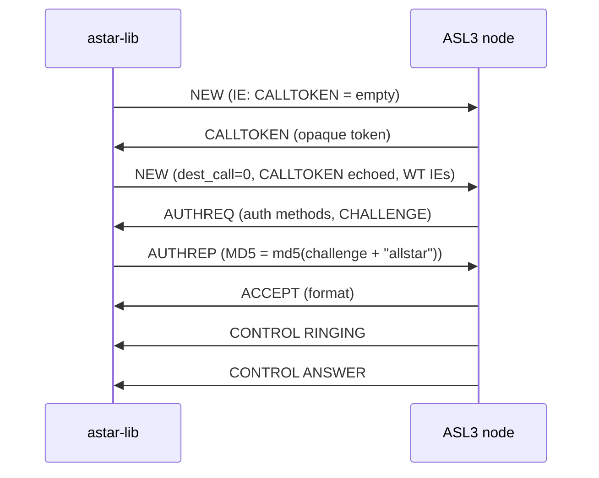
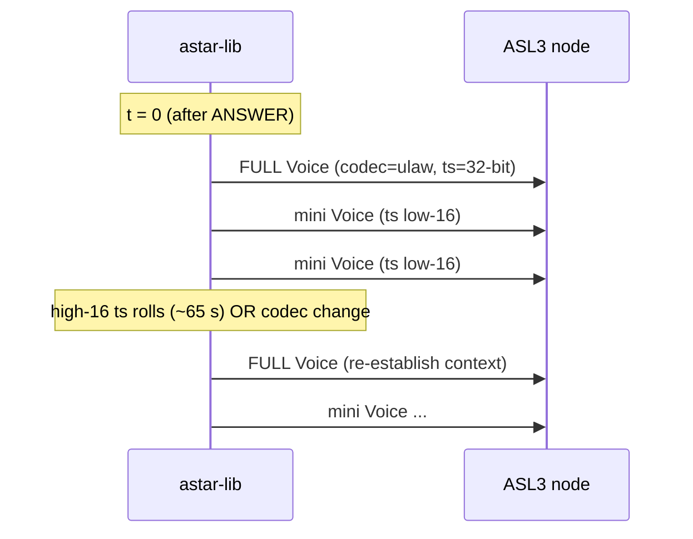

# ASL3 Web Transceiver IAX2 protocol (end to end)

This page documents the **full call flow** an `astar-lib` client uses to
place a Web Transceiver (WT) call into an AllStarLink (ASL3) node, as proven
live against the public parrot/echo node **55553** (`104.232.32.242:4569`).
It covers three stages: **out-of-band portal auth**, the **IAX2 call setup**,
and the **media + teardown** rules.

The IAX2 mechanics are standard [RFC 5456][rfc] except where called out;
everything in the "Web Transceiver auth" stage is an AllStarLink layer with
**no RFC basis**.

[rfc]: https://datatracker.ietf.org/doc/html/rfc5456

!!! abstract "TL;DR"

    1. **Portal-side (HTTPS, out of band):** log into the AllStarLink portal
       with your callsign + portal account password, mint a Web Transceiver
       **token**. That token becomes the IAX2 `CALLING_NAME`.
    2. **IAX2 setup:** `NEW` (empty CALLTOKEN) → `CALLTOKEN` → resent `NEW`
       (`dest_call = 0`, echoed CALLTOKEN, WT IEs) → `AUTHREQ` → `AUTHREP`
       `md5(challenge + "allstar")` → `ACCEPT` → `RINGING` → `ANSWER`.
    3. **Media:** the **first** post-answer voice frame must be a **full**
       Voice frame; later frames are mini frames. Mini-only output triggers a
       VNAK storm and a clear.

## Stage 1 — Web Transceiver authentication (out of band)

ASL3 gates Web Transceiver guests behind a portal-minted token. The IAX2
credentials themselves are the **shared guest** `allstar-public` / `allstar`;
the per-user identity is carried by the token in the `CALLING_NAME` IE and
validated by the node's dialplan, **not** by the IAX2 AUTHREP.

!!! warning "This entire stage is out-of-band and undocumented"

    Plain IAX softphones (iaxRpt etc.) **cannot** pass this gate natively — it
    requires an active portal-side WT session. The dedicated WT apps
    (Transceive, DVSwitch Mobile, SharkRF) reverse-engineered it; the flow
    below replicates DroidStar's `obtain_asl_wt_creds`. The token scrape is
    unofficial and fragile (markup can drift; a `/api/v2/auth-wt-legacy`
    replacement is planned).

### Minting the token

| Step | Request | Result |
|---|---|---|
| 1. Portal login | `POST https://www.allstarlink.org/portal/login.php` form-encoded `user=<callsign>&pass=<portal account password>` | `PHPSESSID` + `allstar_token` session cookies |
| 2. Mint WT creds | `GET https://www.allstarlink.org/portal/webtransceiver.php?node=<a node you OWN>` (must be your own node; a dummy like `12345` returns "Node not found") | HTML page embedding an `<applet>` whose params **are** the credentials |

The `<applet>` params:

```text
user=allstar-public  pass=allstar  host=<node IAX ip:port>
callingNo=<node>     callingName=<TOKEN>     callSign=<callsign>
```

Scrape the **`callingName`** value — that opaque hex string is the **token**.
It is **callsign-bound and works for any destination node** (in testing it was
minted via node 77777 and used to reach 55553). The token is session-tied;
mint a fresh one per connect.

!!! note "What `mint_wt_token` actually extracts"

    The `<applet>` param table above is historical reverse-engineering context.
    The current `mint_wt_token` implementation (`crates/astar-asl3/src/mint.rs`)
    only extracts the **`callingName`** token from the portal HTML. The other
    applet fields (`user`, `pass`, `host`, `callingNo`, `callSign`) are
    hard-coded or supplied by the caller — they are not scraped.

!!! note "Don't test the token with a direct curl"

    A direct `GET .../authwebphone.pl?<token>` returns `???` — the token
    validates **only inside the real inbound IAX2 call context**, not via a
    standalone HTTP request. Dial it to test it.

### The node-side gate (dialplan)

The guest call lands in the node's `[allstar-public]` dialplan context, which
CURLs the auth helper with the `CALLING_NAME` (the token):

```text
... CURL(https://.../authwebphone.pl?<CALLING_NAME>) -> RESP
  RESP == "OHYES<callsign>"  -> proceed (connect to the node, run Rpt())
  RESP == "???" (or not "OHYES...") -> Answer; Wait(1); Hangup   (cause 16)
```

`authwebphone.pl` resolves the token back to its bound callsign. A valid
token yields `OHYES<callsign>` and the call proceeds; anything else yields the
`Answer; Wait(1); Hangup` path — which is why an **un-gated** call appears to
"answer" and then drops **exactly ~1 second later** with cause 16. That
1-second drop is the dialplan's `Wait(1)`, not a protocol timeout.

!!! danger "The most important debugging lesson from the live test"

    The ~1 s post-answer hangup is **not** an IAX2, media, or keepalive
    problem — it is the dialplan rejecting the `CALLING_NAME`. The "answer"
    you see is the *reject* path's `Answer`, not `app_rpt`. With a valid
    token, the call instead plays "connected to node N" and stays up
    (confirmed: 26 s, 344 voice frames in, vs the 1 s drop).

## Stage 2 — IAX2 call setup

This is mostly standard IAX2 ([RFC 5456 §6, §8][rfc]) plus ASL3's
CALLTOKEN-with-`dest_call=0` requirement and the WT IE set.



### CALLTOKEN exchange

1. Send a `NEW` carrying **only an empty `CALLTOKEN` IE** (no other IEs
   needed yet). This is the RFC 5456 §6.7 / §8.6.x anti-spoofing call-token
   challenge.
2. The peer replies with a `CALLTOKEN` frame containing an opaque token.
3. **Resend the `NEW`** echoing that token back, now carrying the full WT IE
   set.

!!! danger "ASL3 rule: the resent NEW must carry `dest_call = 0`"

    A `NEW` must **always** have `dest_call = 0` — even the resent one after a
    CALLTOKEN. Do **not** set `dest_call` to the `source_call` of the
    CALLTOKEN frame (that scallno is a temporary anti-spoof value). ASL3
    **REJECTs** a `NEW` with a non-zero `dest_call`. The peer's real call
    number is learned **later**, from the `AUTHREQ` that follows (in testing
    the CALLTOKEN came from `src=1` but the AUTHREQ from `src=6314`).

    This was a wire-proven bug in `astar-lib` (a misreading of RFC 5456
    §8.6.1): flipping the resent-NEW `dest_call` 0→1 reproduced the REJECT.

### The resent `NEW` IE set (Web Transceiver shape)

| IE | Value | Notes |
|---|---|---|
| `CALLTOKEN` | the token echoed from the peer's CALLTOKEN frame | RFC 5456 anti-spoof |
| `VERSION` | `2` | IAX2 protocol version |
| `CALLED_NUMBER` | `"s"` | the dialplan start extension — **not** the destination node |
| `CALLING_NUMBER` | `<destination node>` | the node you are dialing (e.g. `55553`); the dialplan does `Rpt(${CALLERID(num)})`, so this **must** equal the target node, not your own |
| `CALLING_NAME` | `<token>` | the portal-minted WT token; the dialplan's auth gate |
| `USERNAME` | `allstar-public` | the shared WT guest user |
| `FORMAT` | `ulaw` | codec |
| `CAPABILITY` | **(omitted)** | the WT shape sends **no** CAPABILITY IE |

!!! note "Divergence from a normal IAX2 client"

    A normal IAX2 `NEW` sends `CALLED_NUMBER = <what you dialed>` and a
    `CAPABILITY` IE advertising supported codecs. The WT shape instead pins
    `CALLED_NUMBER = "s"`, smuggles the destination node into
    `CALLING_NUMBER` (because the dialplan reads `CALLERID(num)`), and omits
    `CAPABILITY` entirely. This is ASL3/`app_rpt` dialplan-specific, not
    RFC 5456.

### Authentication

ASL3 replies with `AUTHREQ` carrying a challenge. Compute the response as
standard IAX2 MD5 auth ([RFC 5456 §8.6.13][rfc]):

```text
AUTHREP md5 = MD5( challenge_string + "allstar" )
```

`"allstar"` is the shared guest secret (paired with username
`allstar-public`). The per-user AllStar **account** password is consumed
entirely by the Stage-1 portal/token step — it is **not** used in the IAX2
AUTHREP. On success the node sends `ACCEPT`, then `CONTROL RINGING` and
`CONTROL ANSWER`.

!!! note "RINGING and ANSWER are not guaranteed"

    The FSM treats `ACCEPT` as the connection trigger — the call enters the
    active/media state on `ACCEPT`. `CONTROL RINGING` and `CONTROL ANSWER` may
    or may not follow depending on the dialplan. Do not gate media on receiving
    both signals; `ACCEPT` is sufficient.

## Stage 3 — Media

Once answered, audio is carried by IAX2 Voice frames. The keying behavior
(how the node decides you are "transmitting") is described on the
[app_rpt TEXT commands](app-rpt-text-commands.md) page — for a WT caller the
node is in `RADIO_KEY_NOT_ALLOWED` mode, so **your voice frames key the link**.

### First frame must be a full Voice frame

!!! danger "RFC 5456 §6.4 — establish context with a full Voice frame first"

    The **first** media frame after answer **must** be a **full Voice frame**
    (`FrameType::Voice`, codec in the subclass, full 32-bit timestamp).
    Subsequent frames may be **mini frames** carrying only the low 16 bits of
    the timestamp — they inherit the codec and high-16 timestamp bits from the
    last full frame. You must also re-send a full Voice frame:

    - on a **codec change**, and
    - when the **high 16 bits of the 32-bit timestamp roll over** (~every 65 s).

    Sending **mini-only** output (no establishing full frame) triggers a
    **VNAK storm** and a clear. This was wire-proven: a mini-only stream drew
    65 VNAKs and 0 echo, then HANGUP cause 16. The fix sends the first frame
    (and codec-change / timestamp-rollover frames) as full Voice and the rest
    as mini.



### Keepalives

`chan_iax2` drives the keepalives on its own schedule (self-rescheduling); the
**peer does not need to PING you**:

- `PING` roughly every **~21 s**
- `LAGRQ` roughly every **~10 s**

These are standard IAX2 reliability frames (RFC 5456 §8.4 PING/PONG,
§8.4 LAGRQ/LAGRP). A WT client should answer them but need not initiate beyond
its own reliability needs.

## Teardown — hangup cause

When the node tears the call down it sends a `HANGUP` carrying a **`CAUSE` IE**
(RFC 5456 §8.6.x cause codes). For example `CAUSE = 16` is **Normal Clearing**
(the same code the `Answer; Wait(1); Hangup` reject path uses). A client
should **surface this cause** rather than flatten it to a generic abort — e.g.
"remote hung up (normal clearing)" — so the operator can distinguish a clean
disconnect from the WT-gate reject.

## Where ASL3 diverges from / layers on plain IAX2

| Aspect | Plain IAX2 (RFC 5456) | ASL3 / app_rpt |
|---|---|---|
| Auth identity | username + secret in AUTHREP | shared `allstar-public`/`allstar` AUTHREP **plus** an out-of-band portal **token** in `CALLING_NAME`, validated by the dialplan |
| `NEW` after CALLTOKEN | resend with the challenge echoed | additionally **`dest_call` must stay 0** (ASL3 REJECTs non-zero) |
| `CALLED_NUMBER` / `CALLING_NUMBER` | dialed number / caller id | `CALLED_NUMBER="s"`, destination node smuggled in `CALLING_NUMBER` for `Rpt(${CALLERID(num)})` |
| `CAPABILITY` IE | advertised | **omitted** in the WT shape |
| Link keying | n/a | voice-keys-the-link (`RADIO_KEY_NOT_ALLOWED`); see [TEXT commands](app-rpt-text-commands.md) |
| Link-layer signalling | n/a | `!NEWKEY1!` / `!NEWKEY!` / `!!DISCONNECT!!` / `L <list>` TEXT frames |
| Media context | full/mini Voice frames | same RFC rules, but ASL3 **enforces** the first-frame-full rule strictly (VNAK storm otherwise) |

## Confidence and provenance

- **Wire-confirmed against parrot 55553** (live captures, 2026-06-10): the
  CALLTOKEN→resent-NEW→AUTHREQ→AUTHREP→ACCEPT→RINGING→ANSWER sequence; the
  `dest_call=0` REJECT (reproduced by flipping 0→1); the first-frame-full /
  VNAK-storm behavior; the 1 s `Wait(1)` reject vs the held-open valid-token
  call; HANGUP cause 16.
- **Reverse-engineered from app sources** (DroidStar `iax.cpp` /
  `obtain_asl_wt_creds`; `app_rpt` dialplan `[allstar-public]`): the portal
  login + token-mint flow and the `authwebphone.pl` `OHYES`/`???` gate.
- **Standard IAX2** ([RFC 5456][rfc]): frame types, MD5 auth, full/mini Voice
  frames, PING/LAGRQ, CAUSE IE.

The portal scrape is **unofficial and fragile**. The token-mint flow depends
on AllStarLink's portal markup and may break without notice.
